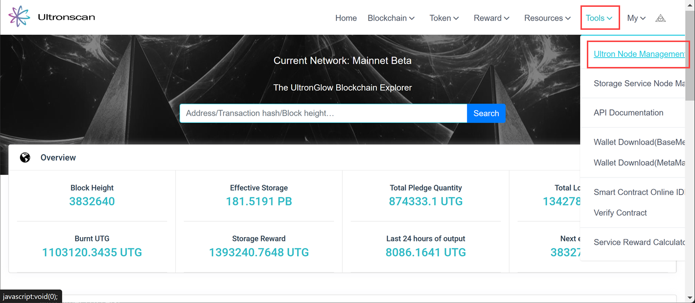
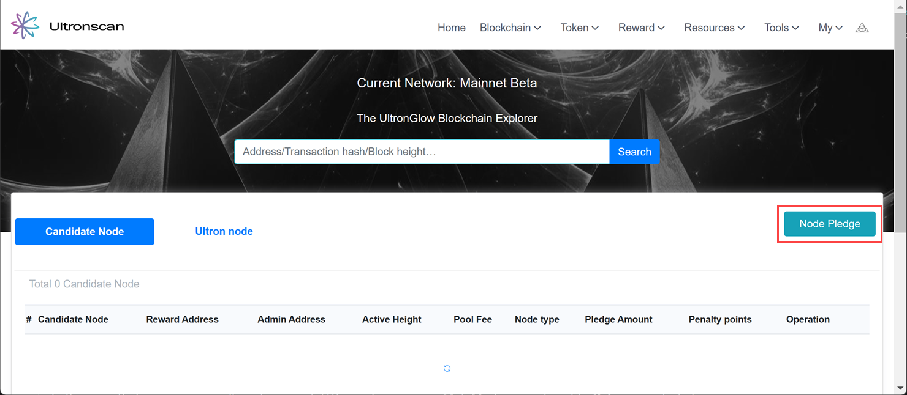
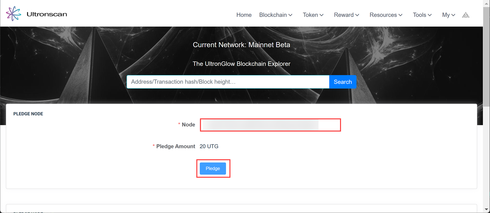

# Validator Staking
---

Once you have the Validator set up complete, you must stake an initial pledge of 20 UTG into your Validator in order for it to
become a candidate for block production.  The process for selection of Validator Nodes to become "active" (known as 
Ultron nodes) is dependent on several factors, including penalty scores as well as the amount of UTG staked into the 
Validator.  The more you stake, the higher probability of being elected as an Ultron Node to generate blocks and earn
block generation rewards.

For details on how Validator nodes are selected to be Ultron Nodes, see the
[whitepaper](https://ultronglow.io/wp-content/uploads/2023/03/UltronGlow-Whitepaper-1.5.1-03072023.pdf).

## Steps

### 1 - Stake your initial pledge

1. Navigate to the [**UltronScan**](https://www.ultronscan.io/).
2. Click on **Tools** in the top-right corner of UltronScan, and then click on **Ultron Node Management** in the menu dropdown.

3. In the new page that appears, click on the **Node Pledge** button.

4. Enter the node address of the Validator you set up in the **Node** field.
5. Click the **Pledge** button.

### 2 - Pledge additional UTG

Once your initial pledge has completed, you'll be able to come back and pledge additional UTG to increase your
opportunity/frequency to become an Ultron Node.

## More Resources

In addition to our documentation, check-out our other resources to help you learn more about
UltronGlow and connect with other UTG'ers!

* Join us on [**Telegram**](https://t.me/UltronGlowOfficial)
* Follow us on [**Twitter**](https://twitter.com/ultronglow)
* Join our community on [**Zealy**](https://zealy.io/c/ultronglow/questboard) and complete quests to earn rewards!
* Read the [**Whitepaper**](https://ultronglow.io/wp-content/uploads/2023/03/UltronGlow-Whitepaper-1.5.1-03072023.pdf)
