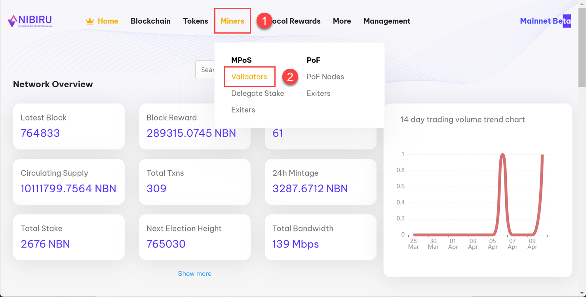

# Validator Staking
Stake NBN in your validator
---

Once you have the validator node set up complete, you must stake an initial pledge of 100 NBN 
into your validator in order for it to become a candidate for block production.  The process 
for selection of Validator Nodes to become "active" is dependent on several factors, including 
penalty scores as well as the amount of NBN staked into the validator. The more you stake, 
the higher probability of being elected as an active validator to generate blocks and earn 
PoS block generation rewards.

For details on how validator nodes are selected to be active, see the
[whitepaper](https://www.nibirunet.io/whitepaper#3.5-features-of-the-mpos-consensus-mechanism).

:::important Qualify to get NBN for staking!

We haven't launched the NBN token yet on exchanges. The first 100 validators to join the Nibiru 
network will have their staking fees covered by us. For more information, join our 
[**Nibiru Insiders**](https://t.me/nibiru_insider) on Telegram.

:::

## Steps

### 1 - Configure Metamask for Nibiru

Complete the [**Configure Metamask**](/docs/getting-started/configure-metamask.md) tutorial to connect to the Nibiru Network.

### 2 - Stake your initial pledge

Open [**Nibiruscan**](https://www.Nibiruscan.io/) in a web browser that supports the Metamask chrome extension.
1. Click on **Miners** in the top navigation bar.
2. Click on the **Validators** under MPoS in the pop-up menu.

3. Click the **BECOME A VALIDATOR** button in the bottom-right corner of the screen.
4. Enter the address of your validator node in the **Validator** field.
5. Click the **Confirm** button to confirm your pledge.

### 3 - Pledge additional NBN

Once your initial pledge has completed, you'll be able to come back and pledge additional NBN to increase your
opportunity/frequency to become an active validator node.
