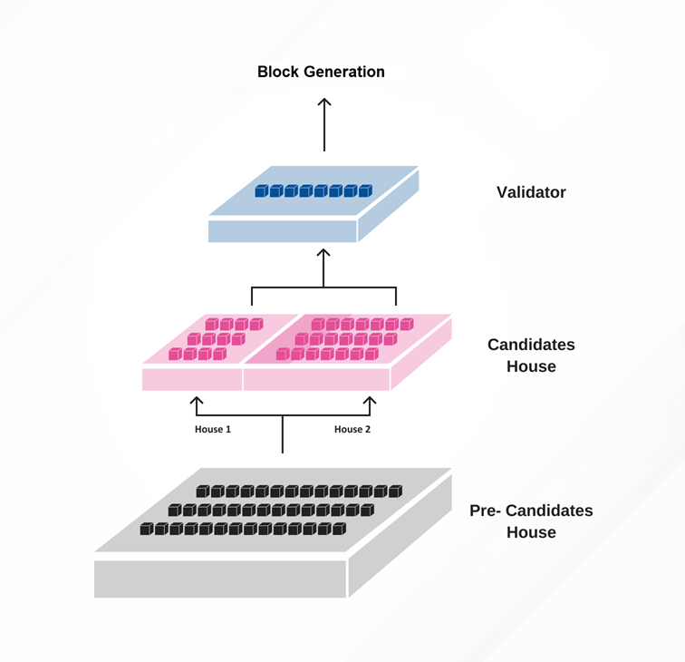
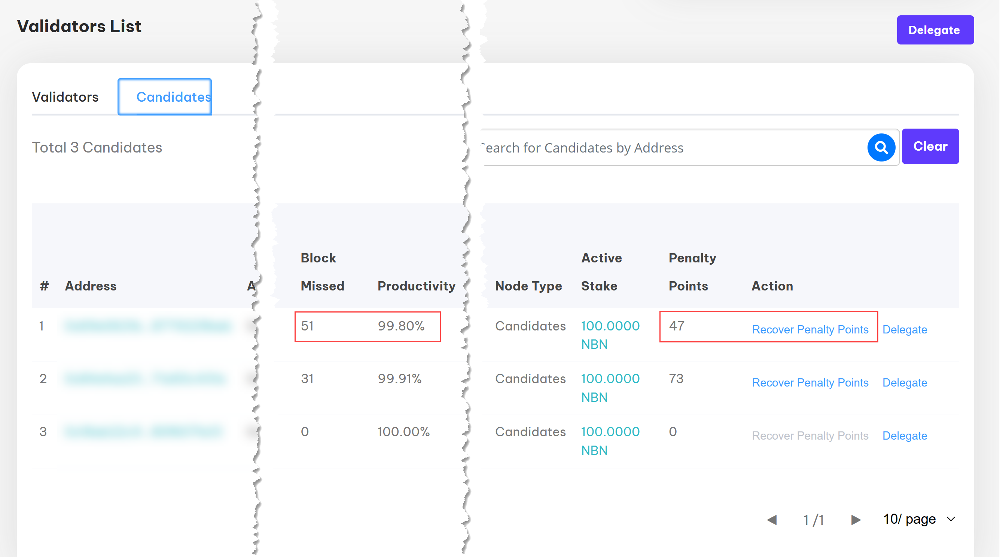

# Layer 1 Network
---

:::note

The following information is taken from the Nibiru Network Whitepaper.  Please read the [full whitepaper](https://www.nibirunet.io/whitepaper#) for more details.

:::

## MPoS Consensus
The MPoS (Multi Proof of Stake) consensus mechanism is an improvement based on the traditional PoS protocol. This system is designed to address the scalability and security issues faced in other networks, while also providing faster transaction processing times and lower energy consumption.

A key feature of MPoS is its dual-chamber model, which divides the candidate nodes into two separate pools with different proportions of candidates. The upper and lower house system ensures that nodes with a larger number of pledges have more opportunities to produce blocks, while smaller nodes also have a chance to participate in the block production process, thereby avoiding class solidification and consensus rigidity. In other words, in each round of witness node election, a corresponding number of nodes are selected according to the equity algorithm to give the right to produce blocks (that is, verification node), and at the same time combined with the benefit algorithm to ensure that each participant can get the opportunity to produce a block.

The MPoS consensus mechanism also offers faster block confirmation times. In the MPoS network, a block is solidified immediately upon its production and then confirmed by 21 verifiers within 10 seconds, resulting in faster convergence speeds and reduced rollback risks.

Moreover, the MPoS network has a stable distribution of block generation time, producing a block every 10 seconds with an average waiting time of 6 seconds for transaction processing. This ensures that the network maintains optimal performance and transaction processing speeds.

The MPoS verification process as used by Nibiru Network, is also expanded beyond transaction verification, as the verifier is responsible for verifying participants in the PoC and PoF protocols, with additional responsibilities and benefits compared to traditional PoS. This expanded scope of verification ensures the integrity and security of the network.

Another key advantage of MPoS is its low participation threshold. The 100 NBN pledge entry threshold is far lower than other networks that adopt PoS consensus in the industry. This allows anyone to participate in the network as a verifier, ensuring decentralized participation and a more secure network.

Finally, the MPoS network has a built-in mechanism that allows for faster detection of issues with validator participation in a single slot. This means that potential problems with the network can be identified and addressed quickly, ensuring optimal network performance and security.

Overall, the MPoS consensus mechanism offers a range of features and benefits that make it an industry-recognized optimal solution for blockchain networks. Its fairer dual-chamber system, faster block confirmation times, stable block generation times, expanded verification process, low participation threshold, and faster problem detection makes it a highly secure, efficient, and scalable blockchain solution.

## Delegation & Verification
The MPoS protocol plays a crucial role in Nibiru Network's consensus mechanism. It enables the delegator to delegate NBN to a verification address and receive a share of the validator's block reward. The validator, on the other hand, is responsible for operating the Verification Node, generating blocks, and distributing the block reward to all delegators.

To participate in MPoS delegation and verification, an individual must stake the specified amount of NBN and become a validator. Upon withdrawal, the validator will receive their full pledge back. The validator has the ability to set the fee percentage, and the remaining verification rewards will be distributed among the delegators. Any address can delegate NBN to any validator, but at the same time, the same address can only delegate NBN to one validator. The entrusted NBN is locked up for a period of 7 days and can be withdrawn after the lock-up period expires

## Staking & Locking Time
In terms of staking and locking periods, Nibiru Network employs specific lock-up and lock-release rules for pledges on Multi Proof of Stake (MPoS), Proof of Flow (PoF), and Proof of Capacity (PoC) protocols. Pledges on these protocols are subject to a one-year lock-up period. Upon completion of the lock-up period, rewards and released pledges are subject to a 30-day lock-up period, followed by a 365-antenna linear release. Under this model, the locked amount is gradually released over a 365-day period, with a proportionate amount being released each day.

For delegators, the stake freeze period is seven days. This means that after delegating tokens, a delegator cannot withdraw them for a period of seven days. These lock-up and freeze periods help to ensure stability and security within the Nibiru Network ecosystem, promoting the long-term growth and success of the platform

## Validator Node Penalty Mechanism
MPoS nodes come equipped with a penalty point mechanism designed to encourage block verification. If a verification node misses blocks during an ePoCh, penalty points are added. If the penalty points exceed 30, the node is no longer eligible to become a validator. If the penalty points exceed 30 days without payment, the node will be automatically exited from the MPoS protocol, leading to the destruction of the NBN staked by the node and the unreleased rewards in the node's earnings address.

Users can pay NBN to eliminate penalty points within the MPoS protocol. However, the NBN used for this purpose will be destroyed. The penalty point mechanism within MPoS nodes promotes accountability and reliability in the Nibiru Network ecosystem, ensuring the continued stability and success of the platform.

