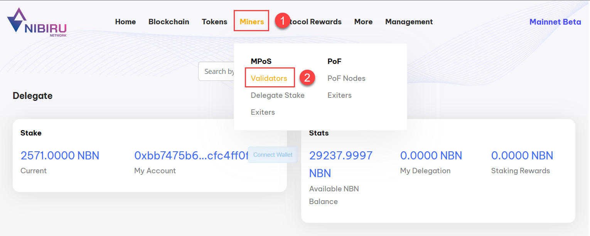
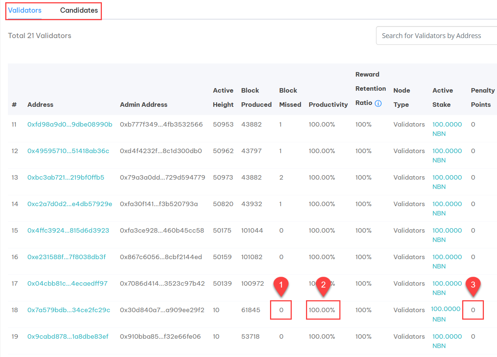
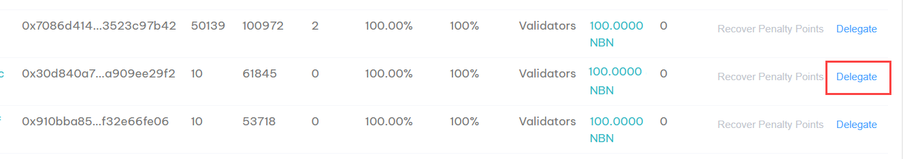
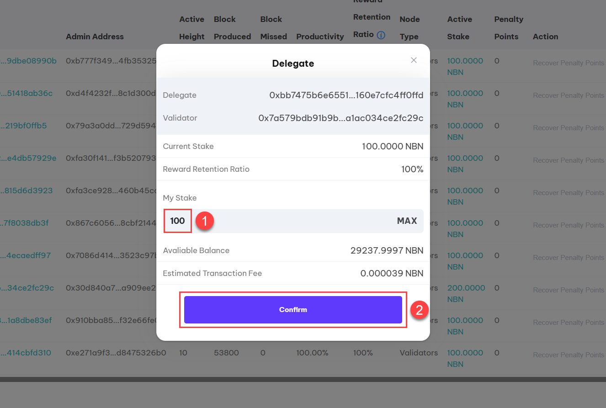
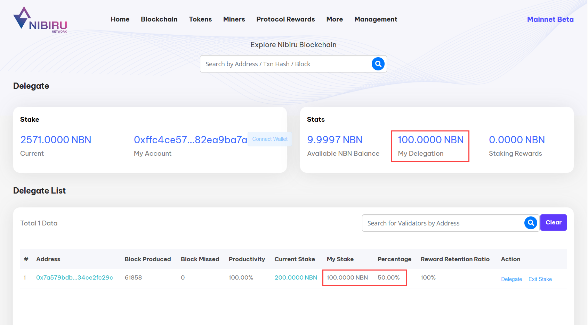

# Delegate Staking
Delegate NBN into a validator
---

Validators on the Nibiru Network earn MPoS rewards for block generation on the blockchain.  Rewards
are based partially on the amount of NBN the validator has staked.  The more staked, the higher
the MPoS rewards.

The operator of a validator node is responsible for staking the minimum amount of 100 NBN tokens 
when initially setting-up their validator node, but can increase the staked amount over time.
Additionally, holders of NBN can also stake their tokens into existing validators, sharing the
MPoS rewards for the node.  This is called "delegate staking", and not only offers an opportunity
for anyone with NBN to share in MPoS rewards, by also further secures the Nibiru Network by
increasing the amount of liquidity staked into the network.

Visit the [**Nibiru Network website**](https://www.nibirunet.io/staking) to learn more about staking.

:::tip 

The NBN token is not yet listed on Decentralized Exchanges (DEX).  For parties interested in bringing
up a validator node on the Nibiru Network, your initial stake of 100 NBN will be covered by us. 
For more information, join [**Nibiru Insiders**](https://t.me/nibiru_insider) on Telegram.

:::

## Steps

### 1 - Configure Metamask

Complete the [**Configure Metamask**](/docs/getting-started/configure-metamask.md) tutorial to connect to the Nibiru Network.

### 2 - Choose a validator to pledge

Open [**Nibiruscan**](https://www.Nibiruscan.io/) in a web browser that supports the Metamask chrome extension.
1. Click on **Miners** in the top navigation bar.
2. Click on the **Validators** under MPoS in the pop-up menu.

Scroll down to the **Validators List** to see the validators currently in the Nibiru Network.
By default, active validators are shown in the **Validators** tab while those waiting for their
turn to be an active validator are shown in the **Candidates** tab.  Choosing a validator in
either is fine, however it's important to choose a validator based on the following criteria:

1. Has a low **Block Missed** count (ideally 0).
2. Has a high **Productivity** score (ideally 100%).
3. Has a **Penalty Points** score of 0.

### 3 - Delegate your stake

Once you've identified a validator to delegate your stake into, click on **Delegate**.

1. Enter the amount of NBN you want to delegate in the **My Stake** text box.
2. Click the **Confirm** button to confirm your pledge.

A Metamask prompt will appear to confirm the transaction.

### 4 - View delegate status

Once your confirmation is completed (which may take a minute or two), you can see the status of
your pledge in Nibiruscan by visiting https://www.nibiruscan.io/delegate. 

