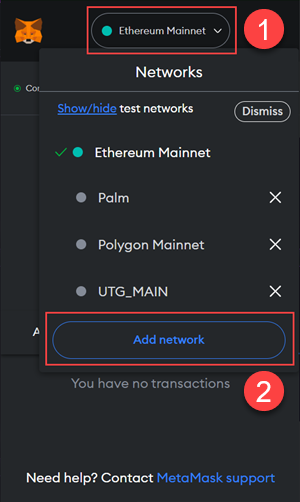
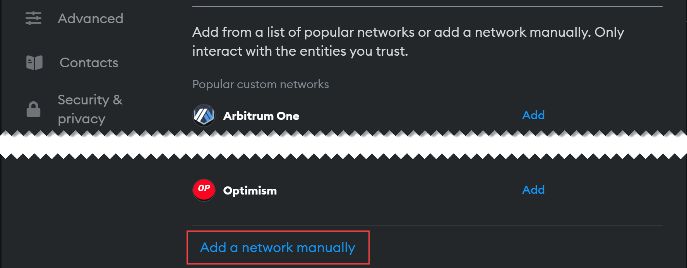

# Configure Metamask
---

In order to interface with the Nibiru Network, you must connect your wallet to the RPC endpoint of
the network.

#### Steps

If you haven't already, install the [Metamask wallet](https://metamask.io/download/) and create an account.

Once Metamask has been installed, you will need to connect it to the Nibiru Network doing the following:

1. Click on the **Networks** drop-down at the top.
2. Click **Add network**.

3. Click **Add a network manually** at the bottom of the networks page (or **Custom Networks** in mobile).

Enter the following Nibiru Network details:

* **Network name** - `Nibiru Network`
* **New RPC URL** - `https://rpc.nibiruscan.io`
* **Chain ID** - `16777`
* **Currency symbol** - `NBN`
* **Block explorer URL** - `https://www.nibiruscan.io/`