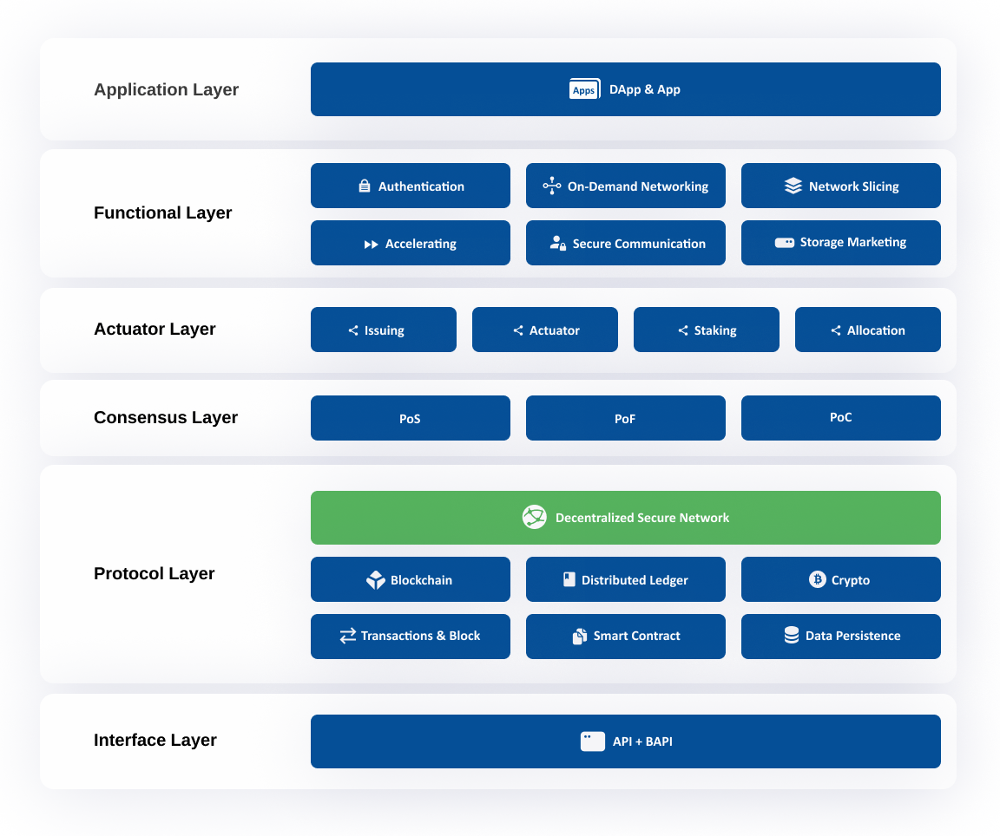

# Introduction
---

:::note

The following information is taken from the Nibiru Network Whitepaper.  Please read the [full whitepaper](https://www.nibirunet.io/whitepaper#) for more details.

:::

[Nibiru Network](https://www.nibirunet.io) is a decentralized and secure network that facilitates the development of Web3 applications through the use of three consensus protocols: Multi Proof of Stake (MPoS), Proof of Flow (PoF), and Proof of Capacity (PoC). The platform is built on SDN/SDVN technology, enabling Resource Providers to contribute resources, and Consumers to use the services.

The key feature of Nibiru Network is the provision of a secure, open, high-speed, co-constructed, and shared decentralized IP layer network based on SDN/SDVN networking technology. The network provides an open and closed-loop economic ecosystem where Users can benefit from each other's services. Resource Providers are responsible for maintaining system stability across the blockchain layer, IP network service layer, storage service layer, and Web3 application layer, offering a variety of services in the real-world application market.

Nibiru Network is a Layer-1 public blockchain with robust smart contract capabilities that are fully compatible with the Ethereum Virtual Machine (EVM). This compatibility allows developers to migrate or deploy their projects from Ethereum, offering Users the same dApp experience at a lower cost.

Nibiru Network’s native token is NBN, which has a maximum supply of 1,000,000,000. Resource Providers can mine for NBN, while Consumers burn NBN, through the protocol, in order to get digital access to Nibiru Network's ecosystem. This incentivizes the development of the network and ensures the circulation of the NBN token within the ecosystem. NBN tokens are also used to facilitate traffic consensus PoF and effective storage consensus PoC powered by the SDN/SDVN technology.

The mining process in Nibiru Network involves various Contributors, such as block generation and verification Contributors, IP layer network Contributors, storage Contributors, and application Contributors. The consumption of services on the network requires the burning of NBN tokens, through the protocol, which reduces the supply of tokens over time, supporting the NBN and the long-term success of Nibiru Network.

In summary, Nibiru Network is a decentralized and secure platform for Web3 applications that incentivizes development through the use of consensus protocols, and provides a secure IP layer network. The network operates on a collaborative relationship between Consumers and Contributors and offers powerful smart contract capabilities that are fully compatible with the Ethereum Virtual Machine (EVM).

## Learn more
Have more questions about the Nibiru Network and its capabilities?  See [About the Nibiru Network](https://www.nibirunet.io/about) to learn about **Resource Providers** and the **NBN Token**.  

General questions?  See the [FAQ](https://www.nibirunet.io/faq).

## More coming soon!
While the Nibiru Network is [live](https://www.nibiruscan.io) today, we're currently focusing on encouraging
the community on-board to the network through deploying a validator node.  Later this year, network 
participants will be able to **Share**, **Earn** and **Burn**. If you're ready to help **Build** the Nibiru network
and earning MPoS NBN rewards, continue on to the [**Next Step**](become-a-validator/get-started-validator.md)
and deploy a validator.